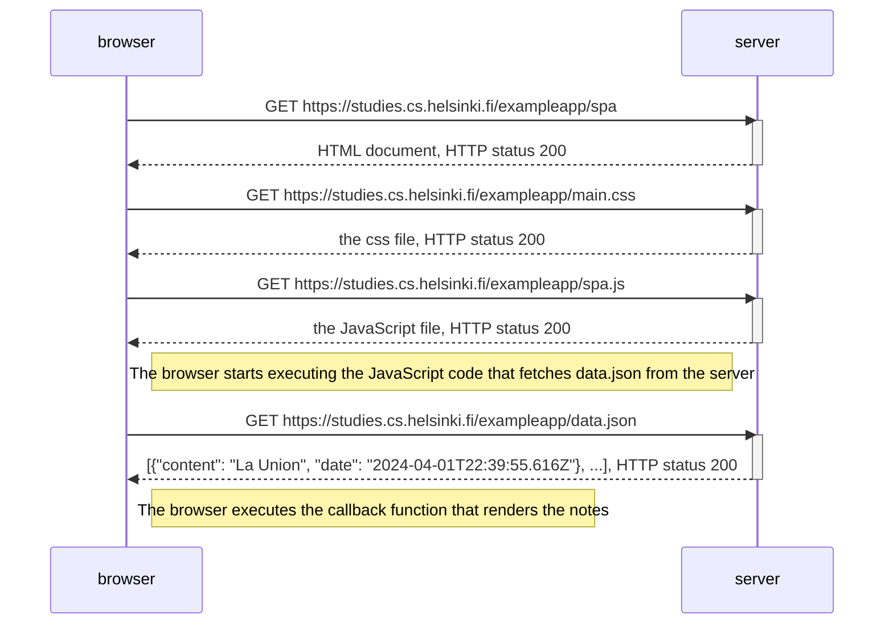

```mermaid
sequenceDiagram
    participant browser
    participant server
    
    browser->>server: GET https://studies.cs.helsinki.fi/exampleapp/spa
    activate server
    server-->>browser: HTML document, HTTP status 200
    deactivate server
    
    browser->>server: GET https://studies.cs.helsinki.fi/exampleapp/main.css
    activate server
    server-->>browser: the css file, HTTP status 200
    deactivate server
    
    browser->>server: GET https://studies.cs.helsinki.fi/exampleapp/spa.js
    activate server
    server-->>browser: the JavaScript file, HTTP status 200
    deactivate server
    
    Note right of browser: The browser starts executing the JavaScript code that fetches data.json from the server
    
    browser->>server: GET https://studies.cs.helsinki.fi/exampleapp/data.json
    activate server
    server-->>browser: [{"content": "La Union", "date": "2024-04-01T22:39:55.616Z"}, ...], HTTP status 200
    deactivate server    

    Note right of browser: The browser executes the callback function that renders the notes
```

