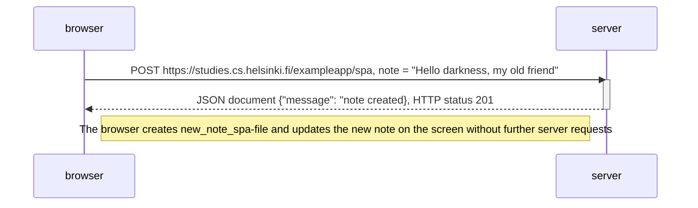

```mermaid
sequenceDiagram
    participant browser
    participant server
    
    browser->>server: POST https://studies.cs.helsinki.fi/exampleapp/spa, note = "Hello darkness, my old friend"
    activate server
    server-->>browser: JSON document {"message": "note created}, HTTP status 201
    deactivate server
    
    Note right of browser: The browser creates new_note_spa-file and updates the new note on the screen without further server requests
```

